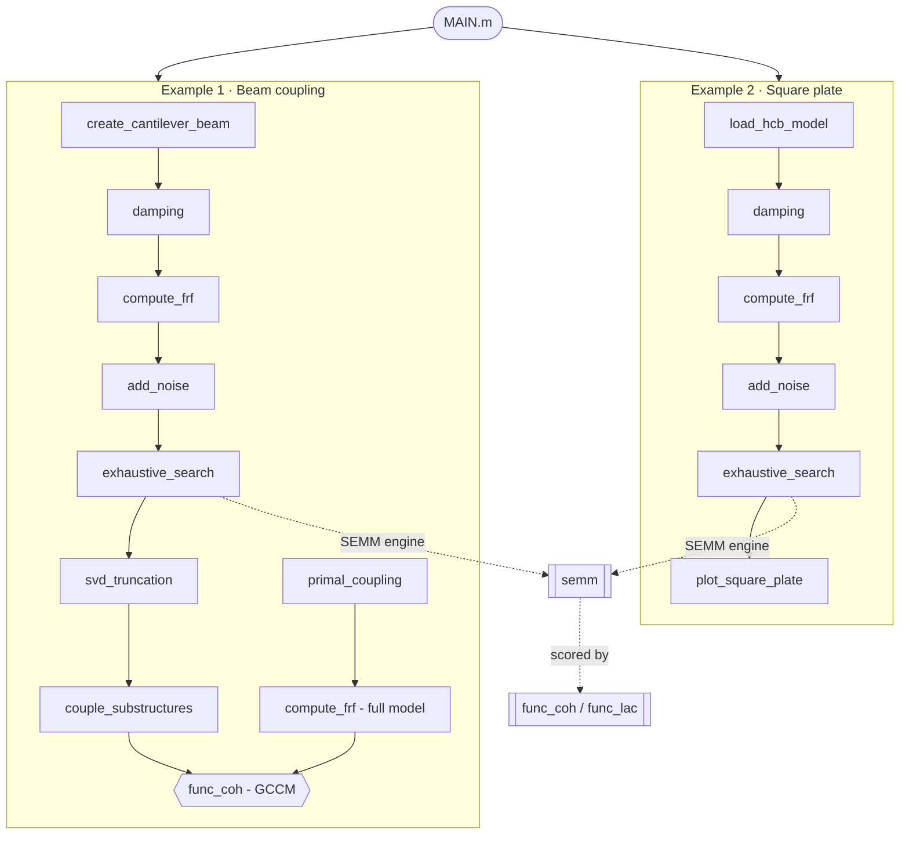

# Optimal Interface Expansion

Companion code for the paper:

> **Muhammad Junaid Ali, Muhammad Safdar, Zeeshan Saeed, Abdullah Jamil, Hafiz Mohammad Mutee Ur Rehman and Muhammad Umer (2026).**
> *Enhancing structural coupling: A frequency-based methodology for optimal interface expansion.*
> Journal of Sound and Vibration 635 (2026) 119782.
> [DOI](https://doi.org/10.1016/j.jsv.2026.119782)

The methodology combines **System Equivalent Model Mixing (SEMM)** for FRF expansion with an **Optimal Sensor Placement (OSP)** framework driven by the **Global Coherence Correlation Metric (GCCM, Γ)**. Optimisation is performed by exhaustive search where feasible and by the **Mountain Gazelle Optimizer (MGO)** for larger spaces.

Two case studies are implemented end-to-end: a **two-beam substructure coupling** problem and an **Ansys-reduced square plate**.

---

## Quick start

1. Open MATLAB R2025b (also tested on R2024b).
2. From this folder, run the driver:
   ```matlab
   MAIN
   ```
   (`MAIN.m` adds `utils/` to the path automatically.)

`MAIN.m` contains two self-contained, clearly separated examples:

- **Example 1 — Beam (coupled):** builds two steel cantilevers with Rayleigh damping, generates clean/noisy FRFs, finds the optimal sensor/excitation DoFs per beam by NDP exhaustive search, couples the two SEMM expansions at the interface, and compares the coupled result against the full coupled model (GCCM, Γ).
- **Example 2 — Square plate (no coupling):** loads an Ansys Craig-Bampton (HCB) reduced model from `Data/`, builds the FRFs, finds the optimal sensors/excitations over all valid DoFs, and plots the placement.

The search size is configurable at the top of `MAIN.m` (`num_sensors`, `extra_excitations`); it ships with a small NDP (1 sensor + 1 excitation) so both examples run in about a minute.

---

## Repository structure

```
.
├── MAIN.m                         run this — two worked examples
├── README.md
├── LICENSE
├── Data/                          Ansys Craig-Bampton (HCB) reduced-model files
│   ├── Nodes_36.txt               master-node coordinates
│   ├── KredHB.mapping             matrix-equation / node / DOF map
│   ├── KredHB.txt                 reduced stiffness (Harwell-Boeing)
│   └── MredHB.txt                 reduced mass (Harwell-Boeing)
├── Scripts/
│   └── MAPDL_MOR_Script.txt       Ansys MAPDL model-reduction script
└── utils/
    ├── create_cantilever_beam.m   beam FE model + eigen-solve
    ├── load_hcb_model.m           Ansys HCB reduced-model loader
    ├── damping.m                  modal | proportional (Rayleigh) damping
    ├── frequency_generation.m     rad/s + Hz frequency axes
    ├── compute_frf.m              receptance | mobility | accelerance
    ├── add_noise.m                pyFBS additive noise (paper Eq. 17)
    ├── exhaustive_search.m        generic DP/NDP sensor/excitation search
    ├── semm.m                     System Equivalent Model Mixing (paper Eq. 12)
    ├── svd_truncation.m           rank reduction for noisy SEMM
    ├── func_coh.m, func_lac.m     correlation metrics (COH, LAC)
    ├── primal_coupling.m          substructure assembly (K, M, C)
    ├── couple_substructures.m     dual LM-FBS coupling (transverse | full)
    ├── validate_interface_dofs.m  shared interface-DoF checks
    ├── mgo.m                      Mountain Gazelle Optimizer
    ├── objective_function.m       GCCM fitness for MGO
    ├── estimate_modal_parameters.m, calculate_mac.m, analyze_frf_energy.m
    ├── plot_beam.m, plot_square_plate.m, plot_frf.m, correlation_plot.m,
    │   plot_mode_shape.m, plot_modal_waterfall.m, visualize_mode_shapes.m
    └── cmap_magma.m, cmap_cividis.m
```

---

## Code flow



`exhaustive_search` is geometry-agnostic: it takes an `n x n x nFreq` FRF plus the candidate and validation DoF sets, so the same function drives both the beam and the plate (and any future structure).

Plotting uses the **magma** and **cividis** colormaps from `utils/cmap_magma.m` and `utils/cmap_cividis.m`. They are self-contained and require no extra toolboxes.
Note: the colormaps differ from the published article — changed purely out of preference. :)

---

## Requirements

- MATLAB R2025b (R2024b also tested)
- Parallel Computing Toolbox (`parfor`, `pagemtimes`, `pagemldivide`, `pagesvd`, `pagepinv`) — recommended for efficiency
- Signal Processing Toolbox — only for `estimate_modal_parameters` / modal-ID helpers

---

## Status

Both the beam coupling and square-plate cases are implemented. A supplementary tutorial for obtaining Craig-Bampton reduced models from Ansys Mechanical (accompanying `Scripts/MAPDL_MOR_Script.txt`) is planned.

---

## Licence

Released under the [MIT License](LICENSE) — free to use, modify, and redistribute. Citation is appreciated but not legally required (see below).

---

## Citation

If you use this code, kindly cite the paper as follows.

```bibtex
@article{ALI2026119782,
title = {Enhancing structural coupling: A frequency-based methodology for optimal interface expansion},
journal = {Journal of Sound and Vibration},
volume = {635},
pages = {119782},
year = {2026},
issn = {0022-460X},
doi = {https://doi.org/10.1016/j.jsv.2026.119782},
url = {https://www.sciencedirect.com/science/article/pii/S0022460X26001458},
author = {Muhammad Junaid Ali and Muhammad Safdar and Zeeshan Saeed and Abdullah Jamil and Hafiz Mohammad {Mutee Ur Rehman} and Muhammad Umer},
keywords = {Dynamic substructuring, Optimal sensor placement, Interface dynamics, Frequency response functions, System equivalent model mixing}
}
```
